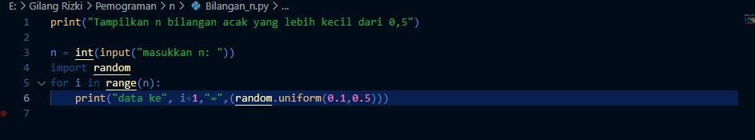
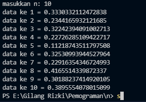
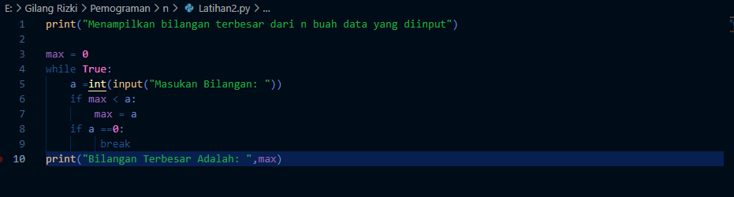
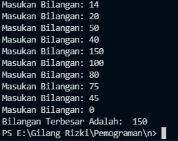
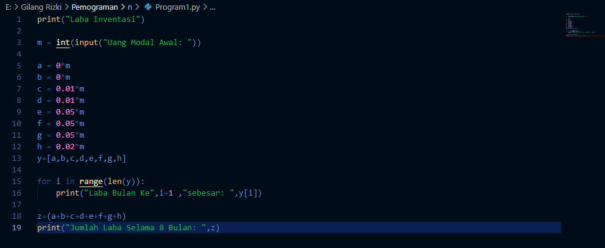
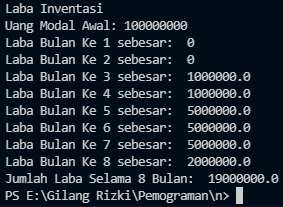

# labspy03

# Latihan1
## Program untuk menampilkan n bilangan acak yang lebih kecil dari dari 0,5

## Hasil program

# Latihan2
## Buat program untuk menampilkan bilangan terbesar dari n buah data  yang diinputkan

## Hasil program

# program1
## program untuk menghitung laba investasi

## Hasil program
